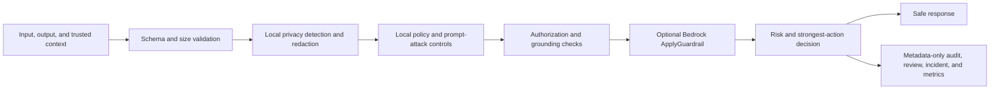

# Bedrock Guardrail Firewall

Turn every generative AI request and response into an enforceable security decision with PII redaction, prompt-injection defense, grounding checks, authorization controls, tamper-evident auditing, and optional Amazon Bedrock Guardrails.

One file. Multiple control planes. Zero implicit cloud calls.


Bedrock Guardrail Firewall is a privacy-first enforcement layer for generative AI systems. It combines deterministic local controls, optional Microsoft Presidio analysis, and the Amazon Bedrock `ApplyGuardrail` API without invoking a foundation model.

The production runtime remains a single Python file: `orchestrator.py`. Policy, documentation, tests, and repository automation are kept separate so the runtime stays portable and auditable.

## Why it is different

- Safe offline default. AWS clients are not created unless live mode is explicitly configured and authorized.
- Bidirectional inspection. User input, candidate output, and retrieval context are evaluated.
- Privacy before cloud. Detected sensitive data is sanitized before optional Bedrock Guardrails calls.
- Local containment before cloud. A local review, escalation, or block decision prevents live content transmission.
- Post-cloud verification. Bedrock-transformed content is size-checked and re-evaluated by local privacy, policy, and grounding controls.
- Strongest control wins. A permissive component cannot override a stricter finding.
- Trusted configuration boundary. Requests cannot select a relaxed policy profile or disable enforcement.
- Fail-safe production profile. Required security integrations block when disabled or unavailable.
- Metadata-only evidence. Audit, review, incident, behavior, and metrics stores exclude raw prompt and response text.
- Tamper evidence. Local audit events form a SHA-256 hash chain with optional AWS KMS signatures.
- Enterprise review routing. Optional Amazon SQS queues support tiered review workflows.
- Immutable remote audit support. Optional Amazon S3 Object Lock and KMS encryption protect evidence.
- Cross-platform operation. The core supports Windows and Linux with Python 3.10 through 3.14. The pinned Presidio stack supports Python 3.10 through 3.13.
- Built-in validation. Doctor, policy validation, self-test, red-team, chaos, audit verification, and request-preview commands are included.

## Control flow



## Quick start

The offline core uses only the Python standard library.

```powershell
python orchestrator.py --presidio-mode disabled doctor
python orchestrator.py --presidio-mode disabled self-test
python orchestrator.py --presidio-mode disabled red-team
python orchestrator.py --presidio-mode disabled evaluate `
  --input "Summarize the approved release checklist." `
  --no-record
```

Linux and macOS shells use the same commands without PowerShell line-continuation characters.

## Optional integrations

Install only what the deployment requires.

```powershell
python -m pip install -r requirements-aws.txt
python -m pip install -r requirements-presidio.txt
```

The dependency groups are deliberately separated:

| File | Purpose |
| --- | --- |
| `requirements.txt` | Standard-library core, no runtime packages |
| `requirements-aws.txt` | Amazon Bedrock, KMS, S3, and SQS integration |
| `requirements-presidio.txt` | Microsoft Presidio and the pinned English NLP model |
| `requirements-dev.txt` | Testing, linting, static analysis, and dependency auditing |

## AWS safety modes

| Mode | Network behavior | Intended use |
| --- | --- | --- |
| `disabled` | No AWS calls and no AWS client creation | Local development, tests, and isolated environments |
| `preview` | Produces redacted request shapes with no AWS calls | Integration review and change approval |
| `live` | Calls configured AWS services | Authorized deployments only |

The CLI requires both `--aws-mode live` and `--enable-live-aws`. This two-part gate helps prevent an accidental cloud call. Automated tests use mocks and never require AWS credentials.

## Decision actions

The runtime returns one of five actions:

| Action | Meaning |
| --- | --- |
| `allow` | No configured control produced a finding |
| `sanitize` | Sensitive or policy-controlled content was irreversibly redacted |
| `queue_for_review` | A human decision is required before higher-risk use |
| `escalate` | Urgent review is required and capabilities are disabled |
| `block` | Processing must stop |

In monitor mode, `action` remains `allow` for observation, while `recommended_action` and capabilities still reflect the security decision.

Sanitized content is released only for `allow` and `sanitize` recommendations. Review, escalation, and block recommendations return empty content fields with `content_released: false`, including in monitor mode.

## Example

```powershell
python orchestrator.py --presidio-mode disabled evaluate `
  --input "Contact analyst@example.invalid for the approved report." `
  --no-record
```

The response includes releasable sanitized content, risk score, recommended and enforced actions, triggered control categories, policy digest, capability restrictions, and privacy-safe diagnostics. It does not return blocked content, local file paths, queue URLs, bucket names, keys, or credentials.

## Policy profiles

- `balanced` provides strong local controls with optional Presidio and AWS integration.
- `production` requires both Presidio and live Bedrock Guardrails, and fails closed when either control is unavailable.
- `offline_test` is reserved for deterministic test execution.

Profiles are selected by trusted deployment configuration. A caller cannot choose a profile in request content.

## Tested baseline

- 163 automated tests across the core, AWS SDK contract, and Presidio integration
- 85 percent branch-aware line coverage
- 100 percent containment in the built-in 10-case adversarial suite
- 100-round deterministic mutation test completed
- All 163 tests passed in an isolated Python 3.12 environment with pinned AWS and Presidio integrations
- Native Windows core execution verified on Python 3.10, 3.11, 3.12, 3.13, and 3.14
- CI matrix configured for Windows and Linux on Python 3.10 through 3.14
- Mocked Bedrock `INPUT` and `OUTPUT` calls, grounding qualifiers, anonymization, interventions, and failure paths
- Audit-chain verification and tamper detection
- Ruff formatting and lint checks
- Bandit static-security scan with no medium or high findings
- Pinned dependency audit with no known vulnerabilities at release preparation time
- Gitleaks secret scanning

See [Testing](docs/TESTING.md) for the complete verification model.

## Documentation

- [Quick Reference](QUICK_REFERENCE.md)
- [Deployment Guide](DEPLOYMENT.md)
- [Policy Schema](docs/POLICY_SCHEMA.md)
- [Threat Model](docs/THREAT_MODEL.md)
- [Testing](docs/TESTING.md)
- [Security Policy](SECURITY.md)
- [Contributing](CONTRIBUTING.md)

## Security notes

This project is a defense-in-depth control, not a replacement for IAM, network isolation, data classification, secure model selection, human oversight, or an organizational authorization process. Local grounding is a deterministic lexical signal, not a proof of truth. Review the threat model and tune policy to the deployment.

Live AWS mode can transmit sanitized content to the configured Amazon Bedrock Guardrail. Review applicable data-handling requirements before enabling it.

## Federal cybersecurity discussion

For practitioner discussion about federal cloud, control effectiveness, evidence, incident response, and mission resilience, visit [r/FederalCyber](https://www.reddit.com/r/FederalCyber/).

It is an independent, unofficial community for public-source discussion. Never post CUI, credentials, customer details, active incident data, or nonpublic vulnerabilities.

## License

Licensed under the Apache License 2.0. See [LICENSE](LICENSE).

Amazon Web Services, AWS, Amazon Bedrock, and related marks are trademarks of Amazon.com, Inc. or its affiliates. Microsoft and Presidio are trademarks or projects of Microsoft. This independent project is not endorsed by or affiliated with Amazon or Microsoft.
