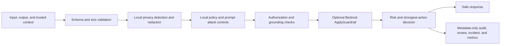

# Bedrock Guardrail Firewall

Turn every generative AI request and response into an enforceable security decision with PII redaction, prompt-injection defense, grounding checks, authorization controls, tamper-evident auditing, and optional Amazon Bedrock Guardrails.

One file. Multiple control planes. Zero implicit cloud calls.


[](https://github.com/fusiontechstrategies/Bedrock-Guardrail-Firewall/actions/workflows/ci.yml)
[](https://github.com/fusiontechstrategies/Bedrock-Guardrail-Firewall/actions/workflows/codeql.yml)
[](https://github.com/fusiontechstrategies/Bedrock-Guardrail-Firewall/actions/workflows/security.yml)

Bedrock Guardrail Firewall is a privacy-first enforcement layer for generative AI systems. It combines deterministic local controls, optional Microsoft Presidio analysis, and the Amazon Bedrock `ApplyGuardrail` API without invoking a foundation model.

The production runtime remains a single Python file: `orchestrator.py`. Policy, documentation, tests, and repository automation are kept separate so the runtime stays portable and auditable.

## Try it offline in 60 seconds

Prerequisites: Git and Python 3.10 or newer. These commands install the standard-library-only core, create no AWS client, and require no credentials.

Windows PowerShell:

```powershell
git clone https://github.com/fusiontechstrategies/Bedrock-Guardrail-Firewall.git
Set-Location Bedrock-Guardrail-Firewall
py -3 -m venv .venv
.\.venv\Scripts\python.exe -m pip install .
.\.venv\Scripts\bedrock-guardrail-firewall.exe --presidio-mode disabled doctor
.\.venv\Scripts\bedrock-guardrail-firewall.exe --presidio-mode disabled evaluate --input "Contact analyst@example.invalid for the approved report." --no-record
```

Linux or macOS:

```bash
git clone https://github.com/fusiontechstrategies/Bedrock-Guardrail-Firewall.git
cd Bedrock-Guardrail-Firewall
python3 -m venv .venv
.venv/bin/python -m pip install .
.venv/bin/bedrock-guardrail-firewall --presidio-mode disabled doctor
.venv/bin/bedrock-guardrail-firewall --presidio-mode disabled evaluate --input "Contact analyst@example.invalid for the approved report." --no-record
```

The evaluation returns a machine-readable decision and only releasable content:

```json
{
  "action": "sanitize",
  "content_released": true,
  "recommended_action": "sanitize",
  "sanitized_input": "Contact [EMAIL_ADDRESS_REDACTED] for the approved report."
}
```

The real response also includes risk, triggered control categories, capability restrictions, diagnostics, and the active policy digest. It excludes blocked content, credentials, local paths, queue URLs, bucket names, and keys.

## Why it is different

- Safe offline default. AWS clients are not created unless live mode is explicitly configured and authorized.
- Bidirectional inspection. User input, candidate output, and retrieval context are evaluated.
- Privacy before cloud. Detected sensitive data is sanitized before optional Bedrock Guardrails calls.
- Local containment before cloud. A local review, escalation, or block decision prevents live content transmission.
- Post-cloud verification. Bedrock-transformed content is size-checked and re-evaluated by local privacy, policy, and grounding controls.
- Strongest control wins. A permissive component cannot override a stricter finding.
- Trusted configuration boundary. Requests cannot select a relaxed policy profile or disable enforcement.
- Fail-safe production profile. Required security integrations block when disabled or unavailable.
- Metadata-only evidence. Audit, review, incident, behavior, and metrics stores exclude raw prompt and response text.
- Tamper evidence. Local audit events form a SHA-256 hash chain with optional AWS KMS signatures.
- Enterprise review routing. Optional Amazon SQS queues support tiered review workflows.
- Immutable remote audit support. Optional Amazon S3 Object Lock and KMS encryption protect evidence.
- Cross-platform operation. The core supports Windows and Linux with Python 3.10 through 3.14. The pinned Presidio stack supports Python 3.10 through 3.13.
- Built-in validation. Doctor, policy validation, self-test, red-team, chaos, audit verification, and request-preview commands are included.

## Control flow



## Reproducible sanitized demo

Run the six synthetic fixtures after completing the quick start:

```powershell
.\.venv\Scripts\python.exe examples\run_sanitized_demo.py
```

The fixture uses disabled cloud integrations, emits no raw high-risk fixture values, and exits nonzero if a decision regresses. Its current deterministic baseline is:

- 6 of 6 expected decisions matched
- 4 of 4 high-risk cases contained
- 0 evaluation-time Python socket attempts

The runner denies Python socket creation, connection helpers, and name-resolution APIs during evaluation. Runtime imports occur before that guard, and the process-level guard does not replace host, container, or virtual-machine network isolation.

The cases cover an ordinary request, redaction, a synthetic identifier, instruction manipulation, prohibited harm, and an unsupported grounded response. Review [the fixture](https://github.com/fusiontechstrategies/Bedrock-Guardrail-Firewall/blob/main/examples/sanitized_demo_cases.json) and [runner](https://github.com/fusiontechstrategies/Bedrock-Guardrail-Firewall/blob/main/examples/run_sanitized_demo.py) before adapting them to a deployment.

## Optional integrations

Install only what the deployment requires.

```powershell
.\.venv\Scripts\python.exe -m pip install ".[aws]"
.\.venv\Scripts\python.exe -m pip install -r requirements-presidio.txt
```

The `aws` and `presidio` package extras install their Python libraries. Presidio is supported on Python 3.10 through 3.13. Its English model is intentionally kept in the pinned `requirements-presidio.txt` source-install path because [public package indexes should not accept direct URL dependencies](https://packaging.python.org/en/latest/specifications/version-specifiers/#direct-references) in published project metadata. The runtime never downloads a missing spaCy model. Run `doctor` after installation; readiness fails when the selected mode or profile requires Presidio and its model is unavailable.

The dependency groups are deliberately separated:

| File | Purpose |
| --- | --- |
| `requirements.txt` | Standard-library core, no runtime packages |
| `requirements-aws.txt` | Amazon Bedrock, KMS, S3, and SQS integration |
| `requirements-presidio.txt` | Microsoft Presidio and the pinned English NLP model |
| `requirements-dev.txt` | Testing, linting, static analysis, and dependency auditing |
| `requirements-build.txt` | Pinned distribution build and validation tools |

The project includes conventional wheel and source-distribution metadata plus the `bedrock-guardrail-firewall` console command. Distribution metadata identifies version 4.1.0. No package is published by this repository automatically. Use only a registry release linked from this repository. The core installation command for an official PyPI release is `python -m pip install bedrock-guardrail-firewall`. If the linked PyPI project does not list 4.1.0, use the source installation above rather than an unverified package with a similar name.

Release candidates use exact version, archive, metadata, SHA-256, provenance, and trusted-publisher gates documented in [RELEASING.md](RELEASING.md). Manual candidate runs cannot publish. Publishing requires an approved GitHub release and approval through the protected `pypi` environment.

## AWS safety modes

| Mode | Network behavior | Intended use |
| --- | --- | --- |
| `disabled` | No AWS calls and no AWS client creation | Local development, tests, and isolated environments |
| `preview` | Produces redacted request shapes with no AWS calls | Integration review and change approval |
| `live` | Calls configured AWS services | Authorized deployments only |

The CLI requires both `--aws-mode live` and `--enable-live-aws`. This two-part gate helps prevent an accidental cloud call. Automated tests use mocks and never require AWS credentials.

## Decision actions

The runtime returns one of five actions:

| Action | Meaning |
| --- | --- |
| `allow` | No configured control produced a finding |
| `sanitize` | Sensitive or policy-controlled content was irreversibly redacted |
| `queue_for_review` | A human decision is required before higher-risk use |
| `escalate` | Urgent review is required and capabilities are disabled |
| `block` | Processing must stop |

In monitor mode, `action` remains `allow` for observation, while `recommended_action` and capabilities still reflect the security decision.

Sanitized content is released only for `allow` and `sanitize` recommendations. Review, escalation, and block recommendations return empty content fields with `content_released: false`, including in monitor mode.

## Library example

```python
from bedrock_guardrail_firewall import BedrockGuardrailSystem, RuntimeConfig

config = RuntimeConfig.from_env(presidio_mode="disabled", aws_mode="disabled")
firewall = BedrockGuardrailSystem(config)
decision = firewall.process(
    "Summarize the approved release checklist.",
    {},
    record=False,
)
print(decision["recommended_action"])
```

Direct one-file execution keeps relative policy, profile, and state paths anchored to the source file directory, preserving the portable source behavior. Installed-package execution resolves explicitly supplied relative paths from the process working directory. The installed defaults use policy documents inside the package and `.guardrail-data` in the working directory.

## Policy profiles

- `balanced` provides strong local controls with optional Presidio and AWS integration.
- `production` requires both Presidio and live Bedrock Guardrails, and fails closed when either control is unavailable.
- `offline_test` is reserved for deterministic test execution.

Profiles are selected by trusted deployment configuration. A caller cannot choose a profile in request content.

## Where it fits and where it does not

Use this project as a policy enforcement point around application traffic. It is not a network firewall, web application firewall, IAM system, malware scanner, factuality oracle, or replacement for human approval. A caller must honor the returned action, content-release flag, and capability restrictions.

The offline regex controls are deliberately deterministic and narrower than contextual PII analysis. The optional Presidio stack improves entity recognition but must be installed and verified separately. Local grounding is a lexical support signal, not proof that an answer is true. Live AWS mode can transmit locally sanitized content to the configured Amazon Bedrock Guardrail and must be approved for the workload's data-handling requirements.

Read the [threat model](https://github.com/fusiontechstrategies/Bedrock-Guardrail-Firewall/blob/main/docs/THREAT_MODEL.md) and [deployment guide](https://github.com/fusiontechstrategies/Bedrock-Guardrail-Firewall/blob/main/DEPLOYMENT.md) before production use.

## Tested baseline

- 177 automated tests across the core, AWS SDK contract, Presidio integration, and sanitized demo
- 86 percent branch-aware line coverage
- 100 percent containment in the built-in 10-case adversarial suite
- 100-round deterministic mutation test completed
- All 177 tests passed in an isolated Python 3.12 environment with pinned AWS and Presidio integrations
- Wheel and source-distribution build, metadata, clean-environment install, console entry point, packaged policy resources, and library import checks
- Six-case sanitized adoption fixture with 100 percent expected decisions and high-risk containment
- Native Windows validation for the 4.1.0 candidate completed on Python 3.10 through 3.14; the Windows and Linux hosted matrix remains a release gate
- Mocked Bedrock `INPUT` and `OUTPUT` calls, grounding qualifiers, anonymization, interventions, and failure paths
- Audit-chain verification and tamper detection
- Ruff formatting and lint checks
- Bandit static-security scan with no medium or high findings
- Point-in-time audits reported no known advisories for the pinned, resolvable dependency sets at validation time; vulnerability data and audit coverage can change
- Gitleaks secret scanning

See [Testing](https://github.com/fusiontechstrategies/Bedrock-Guardrail-Firewall/blob/main/docs/TESTING.md) for the complete verification model.

## Documentation

- [Quick Reference](https://github.com/fusiontechstrategies/Bedrock-Guardrail-Firewall/blob/main/QUICK_REFERENCE.md)
- [Deployment Guide](https://github.com/fusiontechstrategies/Bedrock-Guardrail-Firewall/blob/main/DEPLOYMENT.md)
- [Policy Schema](https://github.com/fusiontechstrategies/Bedrock-Guardrail-Firewall/blob/main/docs/POLICY_SCHEMA.md)
- [Threat Model](https://github.com/fusiontechstrategies/Bedrock-Guardrail-Firewall/blob/main/docs/THREAT_MODEL.md)
- [Testing](https://github.com/fusiontechstrategies/Bedrock-Guardrail-Firewall/blob/main/docs/TESTING.md)
- [Security Policy](https://github.com/fusiontechstrategies/Bedrock-Guardrail-Firewall/blob/main/SECURITY.md)
- [Contributing](https://github.com/fusiontechstrategies/Bedrock-Guardrail-Firewall/blob/main/CONTRIBUTING.md)

## Security notes

This project is a defense-in-depth control, not a replacement for IAM, network isolation, data classification, secure model selection, human oversight, or an organizational authorization process. Local grounding is a deterministic lexical signal, not a proof of truth. Review the threat model and tune policy to the deployment.

Live AWS mode can transmit sanitized content to the configured Amazon Bedrock Guardrail. Review applicable data-handling requirements before enabling it.

## License

Licensed under the Apache License 2.0. See [LICENSE](https://github.com/fusiontechstrategies/Bedrock-Guardrail-Firewall/blob/main/LICENSE).

Amazon Web Services, AWS, Amazon Bedrock, and related marks are trademarks of Amazon.com, Inc. or its affiliates. Microsoft and Presidio are trademarks or projects of Microsoft. This independent project is not endorsed by or affiliated with Amazon or Microsoft.
